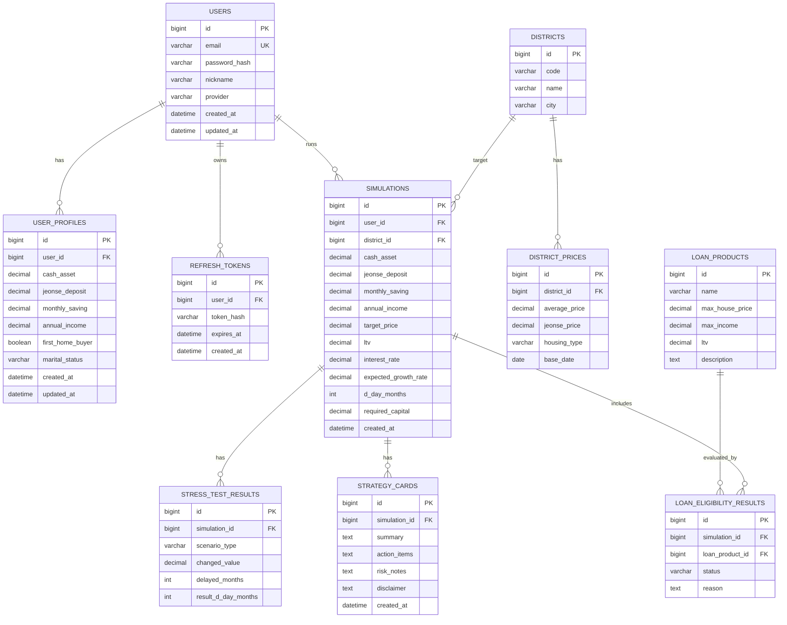

# 04 ERD

> Notion page id: `3870b460-8674-81da-8c0f-d083b1942bc8`
> Source: 

---

# InSeoul ERD
## 1. 설계 전제
수정 반영: **서버 DB 없이 구현하지 않습니다. 로그인 기능을 구현하고, 각 사용자에 대한 서버 DB 데이터 공간을 user_id 기준으로 할당합니다.**
<table header-row="true">
<tr>
<td>구분</td>
<td>MVP 구현</td>
</tr>
<tr>
<td>사용자 인증</td>
<td>users + auth/refresh token</td>
</tr>
<tr>
<td>사용자별 데이터</td>
<td>user_id FK로 프로필/시뮬레이션/AI 전략 카드 분리</td>
</tr>
<tr>
<td>지역 가격</td>
<td>DB seed 또는 정적 데이터 테이블</td>
</tr>
<tr>
<td>정책대출</td>
<td>DB seed 또는 정적 데이터 테이블</td>
</tr>
<tr>
<td>결과 이력</td>
<td>simulations, stress_test_results, strategy_cards 저장</td>
</tr>
</table>
## 2. 엔티티 목록
<table header-row="true">
<tr>
<td>엔티티</td>
<td>설명</td>
</tr>
<tr>
<td>USERS</td>
<td>사용자 계정 정보</td>
</tr>
<tr>
<td>USER_PROFILES</td>
<td>사용자별 재무/주거 조건</td>
</tr>
<tr>
<td>REFRESH_TOKENS</td>
<td>로그인 유지/갱신 토큰</td>
</tr>
<tr>
<td>DISTRICTS</td>
<td>서울 자치구 정보</td>
</tr>
<tr>
<td>DISTRICT_PRICES</td>
<td>지역별 평균 가격 데이터</td>
</tr>
<tr>
<td>LOAN_PRODUCTS</td>
<td>정책대출 상품 정보</td>
</tr>
<tr>
<td>SIMULATIONS</td>
<td>사용자별 시뮬레이션 실행 기록</td>
</tr>
<tr>
<td>STRESS_TEST_RESULTS</td>
<td>스트레스 테스트 결과</td>
</tr>
<tr>
<td>LOAN_ELIGIBILITY_RESULTS</td>
<td>정책대출 판정 결과</td>
</tr>
<tr>
<td>STRATEGY_CARDS</td>
<td>AI 전략 카드 결과</td>
</tr>
</table>
## 3. Mermaid ERD

## 4. 사용자별 DB 할당 방식
- 물리적으로 사용자마다 별도 DB를 만드는 것이 아니라, MVP에서는 **user_id 기반 논리적 데이터 할당**을 사용합니다.
- 모든 사용자 생성 데이터 테이블은 `user_id` 또는 `simulation_id → user_id` 경로로 소유자를 추적합니다.
- API는 인증된 사용자 ID를 기준으로만 조회/수정/삭제합니다.
- 타 사용자 데이터 접근 방지를 핵심 검증 항목으로 둡니다.
<empty-block/>
---
## 5. 모노레포 API 분리와 ERD 영향
AI 기능이 API로 분리되더라도 **DB 저장 주체는 Back-end**입니다. 따라서 ERD의 핵심 구조는 유지하되, 다음 소유권 규칙을 추가합니다.
<table header-row="true">
<tr>
<td>데이터</td>
<td>생성 주체</td>
<td>저장 주체</td>
<td>소유권 기준</td>
</tr>
<tr>
<td>사용자 계정</td>
<td>Back-end API</td>
<td>Back-end DB</td>
<td>`users.id`</td>
</tr>
<tr>
<td>재무 프로필</td>
<td>Front-end 입력 → Back-end</td>
<td>Back-end DB</td>
<td>`user_profiles.user_id`</td>
</tr>
<tr>
<td>시뮬레이션 결과</td>
<td>Back-end 계산</td>
<td>Back-end DB</td>
<td>`simulations.user_id`</td>
</tr>
<tr>
<td>자연어 파싱 결과</td>
<td>Internal AI API</td>
<td>필요 시 Back-end DB/응답만 사용</td>
<td>인증 사용자 세션</td>
</tr>
<tr>
<td>AI 전략 카드</td>
<td>Internal AI API</td>
<td>Back-end DB</td>
<td>`strategy_cards.simulation_id → simulations.user_id`</td>
</tr>
</table>
## 6. 추가 검증 규칙
- `strategy_cards` 저장 전 Back-end는 `simulationId`가 로그인 사용자의 소유인지 확인한다.
- Internal AI API는 `user_id`를 저장 용도로 사용하지 않는다.
- 사용자별 데이터 격리는 Back-end DB 쿼리에서 보장한다.
- AI API 장애 시 Back-end는 fallback 전략 카드를 저장하거나 사용자에게 재시도 응답을 반환한다.
