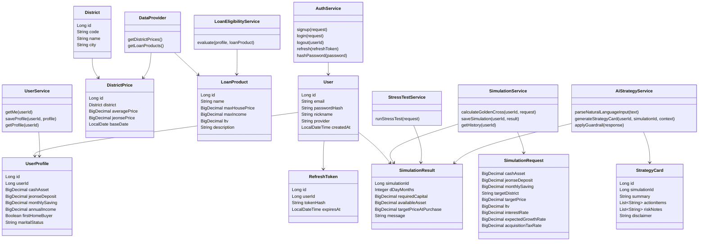
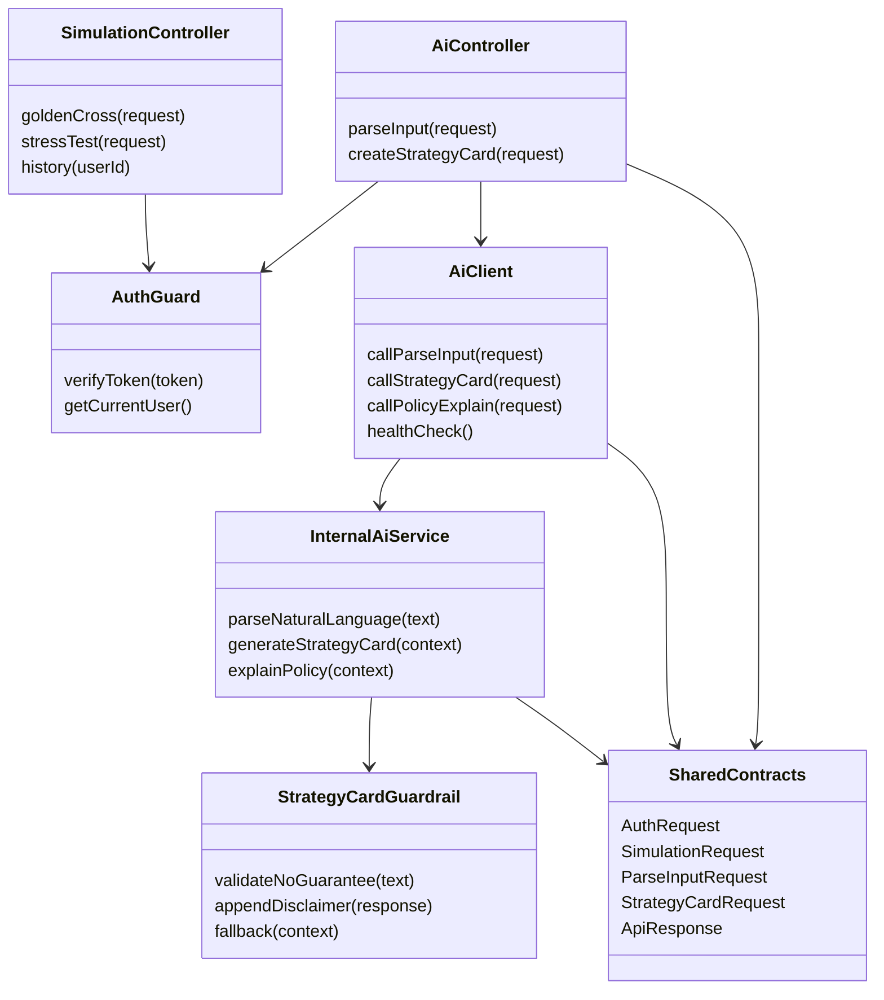

# 06 Class Diagram

> Notion page id: `3870b460-8674-81e0-879b-dde68cce9f64`
> Source: 

---

# InSeoul Class Diagram
## 1. 설계 범위
로그인/사용자별 서버 DB 저장 구조를 포함합니다.
<table header-row="true">
<tr>
<td>영역</td>
<td>주 담당</td>
</tr>
<tr>
<td>인증/화면/Controller/Service 구조</td>
<td>함동균</td>
</tr>
<tr>
<td>AI/Data DTO 및 정책/지역 데이터 구조</td>
<td>김세민</td>
</tr>
</table>
## 2. Mermaid Class Diagram

## 3. 구현 메모
- 모든 사용자 생성 데이터는 인증된 `userId` 기준으로 저장/조회합니다.
- `SimulationService.getHistory(userId)`는 타 사용자 이력을 반환하면 안 됩니다.
- `AiStrategyService.generateStrategyCard`는 `simulationId`와 `userId` 소유권을 확인한 뒤 저장합니다.
- AI 응답에는 항상 disclaimer/guardrail을 포함합니다.
---
## 4. 모노레포 API 분리 반영 클래스

## 5. 책임 분리
<table header-row="true">
<tr>
<td>클래스/모듈</td>
<td>위치</td>
<td>책임</td>
<td>담당</td>
</tr>
<tr>
<td>`AiController`</td>
<td>`apps/api`</td>
<td>Front-end용 `/api/ai/*` 제공</td>
<td>함동균</td>
</tr>
<tr>
<td>`AiClient`</td>
<td>`apps/api`</td>
<td>내부 AI API 호출</td>
<td>함동균</td>
</tr>
<tr>
<td>`InternalAiService`</td>
<td>`apps/ai`</td>
<td>자연어 파싱/전략 카드 생성</td>
<td>김세민</td>
</tr>
<tr>
<td>`StrategyCardGuardrail`</td>
<td>`apps/ai` 또는 `packages/ai-guardrail`</td>
<td>금지 표현/안전 문구 처리</td>
<td>김세민</td>
</tr>
<tr>
<td>`SharedContracts`</td>
<td>`packages/shared-contracts`</td>
<td>FE/BE/AI 공통 타입</td>
<td>공동</td>
</tr>
</table>
