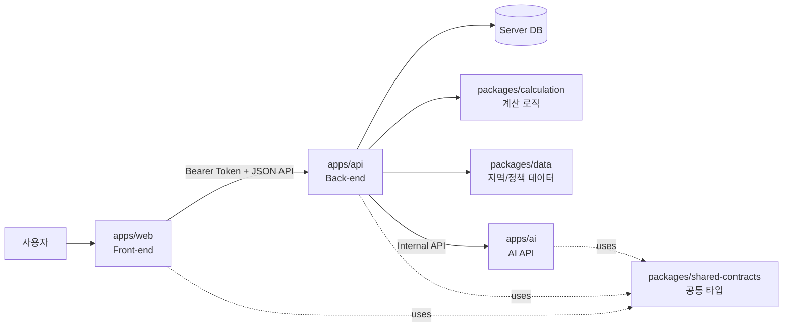

# 08 모노레포 API 분리 변경 계획

> Notion page id: `3870b460-8674-8106-b0fa-e3d9ab3c87b3`
> Source: 

---

## 1. 변경 배경
2인 팀 개발에서 프론트엔드, 백엔드, AI/Data 작업이 동시에 진행되므로, 같은 저장소 안에서 작업하되 각 담당 영역의 충돌을 줄이는 구조가 필요합니다.
이번 변경의 핵심은 다음과 같습니다.
> **모노레포에서 개발하되, Front-end ↔ Back-end ↔ AI 기능은 명확한 API 계약으로 상호작용한다.**
즉, AI 기능을 프론트 내부 함수처럼 직접 호출하지 않고, 백엔드/AI 모듈이 정의한 API를 통해 호출하도록 설계합니다.
---
## 2. 변경 목표
<table header-row="true">
<tr>
<td>목표</td>
<td>설명</td>
</tr>
<tr>
<td>역할 분리</td>
<td>함동균은 FE/BE, 김세민은 AI/Data/CI-CD에 집중</td>
</tr>
<tr>
<td>API 계약 고정</td>
<td>FE-BE-AI 간 요청/응답 JSON을 먼저 확정</td>
</tr>
<tr>
<td>병렬 개발 가능</td>
<td>Mock API와 샘플 응답으로 프론트/AI를 동시에 개발</td>
</tr>
<tr>
<td>인증 연계</td>
<td>로그인 사용자 기준으로 모든 시뮬레이션/AI 결과 저장</td>
</tr>
<tr>
<td>제출 문서 정합성</td>
<td>요구사항, API 설계서, Class Diagram, WBS에 API 분리 구조 반영</td>
</tr>
</table>
---
## 3. 권장 모노레포 구조
```plain text
InSeoul/
├── apps/
│   ├── web/                 # Front-end: React/Vite
│   ├── api/                 # Back-end: 인증, 사용자 DB, 시뮬레이션 API
│   └── ai/                  # AI API: 자연어 파싱, 전략 카드, 정책 설명
│
├── packages/
│   ├── shared-contracts/    # 공통 타입, API Request/Response DTO
│   ├── data/                # 지역 가격, 정책대출 seed 데이터
│   └── calculation/         # D-Day 계산 공식, 검증 케이스
│
├── docs/                    # 제출 문서, 다이어그램 원본
├── .github/workflows/       # CI/CD
└── README.md
```
## 4. 담당 영역
<table header-row="true">
<tr>
<td>영역</td>
<td>주 담당</td>
<td>설명</td>
</tr>
<tr>
<td>`apps/web`</td>
<td>함동균</td>
<td>화면, 상태관리, API 호출, 결과 대시보드</td>
</tr>
<tr>
<td>`apps/api`</td>
<td>함동균</td>
<td>로그인, 사용자 DB, 시뮬레이션 저장, FE용 API</td>
</tr>
<tr>
<td>`apps/ai`</td>
<td>김세민</td>
<td>자연어 파싱, AI 전략 카드, 정책 설명 API</td>
</tr>
<tr>
<td>`packages/data`</td>
<td>김세민</td>
<td>지역 가격/정책대출 데이터</td>
</tr>
<tr>
<td>`packages/calculation`</td>
<td>김세민 주도, 함동균 연동</td>
<td>계산 공식과 테스트 케이스</td>
</tr>
<tr>
<td>`packages/shared-contracts`</td>
<td>공동</td>
<td>API 요청/응답 타입 단일 출처</td>
</tr>
<tr>
<td>CI/CD</td>
<td>김세민</td>
<td>lint/test/build 자동화</td>
</tr>
</table>
---
## 5. 서비스 간 상호작용 원칙
## 5-1. Front-end는 Back-end API만 직접 호출
프론트는 DB나 AI 내부 로직을 직접 호출하지 않습니다.
```plain text
Front-end
  → Back-end API
  → DB / AI API / Data / Calculation
```
### 이유
- 인증 토큰 검증을 백엔드에서 일관 처리
- 사용자별 DB 저장을 백엔드에서 보장
- AI API 키 또는 AI 서버 URL이 프론트에 노출되지 않음
- 프론트 개발자는 API 명세만 보고 개발 가능
---
## 5-2. Back-end는 AI API를 내부 서비스처럼 호출
```plain text
Back-end API
  → AI API
  → AI 응답 수신
  → 사용자별 DB 저장
  → Front-end 응답
```
### 예시
```plain text
POST /api/ai/strategy-card
```
1. 프론트가 백엔드에 요청
2. 백엔드가 사용자 인증 확인
3. 백엔드가 simulationId 소유권 확인
4. 백엔드가 AI API에 전략 카드 생성 요청
5. 백엔드가 응답을 `strategy_cards`에 저장
6. 백엔드가 프론트로 결과 반환
---
## 5-3. AI API는 DB 직접 접근 최소화
AI API는 가능하면 stateless하게 유지합니다.
<table header-row="true">
<tr>
<td>AI API가 받는 것</td>
<td>AI API가 반환하는 것</td>
</tr>
<tr>
<td>자연어 입력</td>
<td>구조화 JSON</td>
</tr>
<tr>
<td>시뮬레이션 결과</td>
<td>전략 카드 JSON</td>
</tr>
<tr>
<td>정책/대출 조건 컨텍스트</td>
<td>사용자 맞춤 설명</td>
</tr>
</table>
DB 저장은 Back-end가 담당합니다.
---
## 6. API 경계 재정의
## 6-1. 외부 공개 API — Front-end가 호출
<table header-row="true">
<tr>
<td>Method</td>
<td>Endpoint</td>
<td>담당</td>
<td>설명</td>
</tr>
<tr>
<td>POST</td>
<td>`/api/auth/signup`</td>
<td>BE</td>
<td>회원가입</td>
</tr>
<tr>
<td>POST</td>
<td>`/api/auth/login`</td>
<td>BE</td>
<td>로그인</td>
</tr>
<tr>
<td>POST</td>
<td>`/api/auth/logout`</td>
<td>BE</td>
<td>로그아웃</td>
</tr>
<tr>
<td>GET</td>
<td>`/api/users/me`</td>
<td>BE</td>
<td>내 정보 조회</td>
</tr>
<tr>
<td>PUT</td>
<td>`/api/users/me/profile`</td>
<td>BE</td>
<td>내 재무 프로필 저장</td>
</tr>
<tr>
<td>GET</td>
<td>`/api/districts/prices`</td>
<td>BE/Data</td>
<td>지역 가격 조회</td>
</tr>
<tr>
<td>POST</td>
<td>`/api/simulation/golden-cross`</td>
<td>BE/Calculation</td>
<td>D-Day 계산 및 저장</td>
</tr>
<tr>
<td>POST</td>
<td>`/api/simulation/stress-test`</td>
<td>BE/Calculation</td>
<td>리스크 계산</td>
</tr>
<tr>
<td>POST</td>
<td>`/api/loans/eligibility`</td>
<td>BE/Data</td>
<td>정책대출 판정</td>
</tr>
<tr>
<td>POST</td>
<td>`/api/ai/parse-input`</td>
<td>BE → AI</td>
<td>자연어 입력 구조화</td>
</tr>
<tr>
<td>POST</td>
<td>`/api/ai/strategy-card`</td>
<td>BE → AI</td>
<td>AI 전략 카드 생성 및 저장</td>
</tr>
<tr>
<td>GET</td>
<td>`/api/simulation/history`</td>
<td>BE</td>
<td>사용자별 이력 조회</td>
</tr>
</table>
## 6-2. 내부 AI API — Back-end만 호출
<table header-row="true">
<tr>
<td>Method</td>
<td>Endpoint</td>
<td>담당</td>
<td>설명</td>
</tr>
<tr>
<td>POST</td>
<td>`/internal/ai/parse-input`</td>
<td>AI</td>
<td>자연어 → 구조화 데이터</td>
</tr>
<tr>
<td>POST</td>
<td>`/internal/ai/strategy-card`</td>
<td>AI</td>
<td>계산 결과 → 전략 카드</td>
</tr>
<tr>
<td>POST</td>
<td>`/internal/ai/policy-explain`</td>
<td>AI</td>
<td>정책대출 조건 설명</td>
</tr>
<tr>
<td>GET</td>
<td>`/internal/ai/health`</td>
<td>AI</td>
<td>AI 서버 상태 확인</td>
</tr>
</table>
---
## 7. 공통 계약 관리
`packages/shared-contracts`에 Request/Response 타입을 둡니다.
```plain text
packages/shared-contracts/
├── auth.ts
├── user.ts
├── simulation.ts
├── loan.ts
├── ai.ts
└── common.ts
```
### 예시
```typescript
export interface ParseInputRequest {
  text: string
}

export interface ParsedUserCondition {
  cashAsset: number | null
  jeonseDeposit: number | null
  monthlySaving: number | null
  annualIncome: number | null
  targetDistrict: string | null
  targetPrice: number | null
  missingFields: string[]
}

export interface StrategyCardResponse {
  strategyCardId?: number
  summary: string
  actionItems: string[]
  riskNotes: string[]
  disclaimer: string
}
```
---
## 8. 문서 수정 계획
<table header-row="true">
<tr>
<td>문서</td>
<td>수정 내용</td>
<td>담당</td>
</tr>
<tr>
<td>요구사항 정의서</td>
<td>“모노레포 + API 기반 상호작용” 비기능 요구사항 추가</td>
<td>김세민</td>
</tr>
<tr>
<td>UseCase Diagram</td>
<td>Front-end, Back-end, AI API 경계가 보이도록 보강</td>
<td>김세민</td>
</tr>
<tr>
<td>WBS</td>
<td>`shared-contracts`, AI API, API 연동 작업 추가</td>
<td>김세민</td>
</tr>
<tr>
<td>ERD</td>
<td>큰 변경 없음. 단, AI 결과 저장 주체가 Back-end임을 명시</td>
<td>김세민</td>
</tr>
<tr>
<td>API 설계서</td>
<td>외부 API와 내부 AI API를 분리</td>
<td>함동균 + 김세민</td>
</tr>
<tr>
<td>Class Diagram</td>
<td>`AiClient`, `AiController`, `InternalAiService`, `SharedContract` 추가</td>
<td>함동균 + 김세민</td>
</tr>
<tr>
<td>화면정의서</td>
<td>프론트는 Back-end API만 호출한다고 명시</td>
<td>함동균</td>
</tr>
</table>
---
## 9. 개발 작업 변경 계획
## Phase 1. API 계약 확정
<table header-row="true">
<tr>
<td>작업</td>
<td>담당</td>
<td>산출물</td>
</tr>
<tr>
<td>공통 Request/Response 타입 정의</td>
<td>공동</td>
<td>`packages/shared-contracts`</td>
</tr>
<tr>
<td>FE가 필요한 API 목록 확정</td>
<td>함동균</td>
<td>API 설계서</td>
</tr>
<tr>
<td>AI API 요청/응답 스키마 확정</td>
<td>김세민</td>
<td>AI contract</td>
</tr>
<tr>
<td>에러 코드 정의</td>
<td>공동</td>
<td>common error schema</td>
</tr>
</table>
## Phase 2. Mock 기반 병렬 개발
<table header-row="true">
<tr>
<td>작업</td>
<td>담당</td>
<td>산출물</td>
</tr>
<tr>
<td>FE Mock API 응답 작성</td>
<td>함동균</td>
<td>mock data</td>
</tr>
<tr>
<td>AI 샘플 응답 작성</td>
<td>김세민</td>
<td>parse/strategy sample</td>
</tr>
<tr>
<td>BE API skeleton 작성</td>
<td>함동균</td>
<td>controller/service</td>
</tr>
<tr>
<td>AI API skeleton 작성</td>
<td>김세민</td>
<td>`/internal/ai/*`</td>
</tr>
</table>
## Phase 3. 인증/DB/시뮬레이션 연결
<table header-row="true">
<tr>
<td>작업</td>
<td>담당</td>
<td>산출물</td>
</tr>
<tr>
<td>로그인/토큰 인증 구현</td>
<td>함동균</td>
<td>Auth API</td>
</tr>
<tr>
<td>사용자별 DB 저장 구현</td>
<td>함동균</td>
<td>user_id 기반 저장</td>
</tr>
<tr>
<td>D-Day 계산 API 연결</td>
<td>함동균</td>
<td>Simulation API</td>
</tr>
<tr>
<td>계산 검증 케이스 제공</td>
<td>김세민</td>
<td>test cases</td>
</tr>
</table>
## Phase 4. AI API 연동
<table header-row="true">
<tr>
<td>작업</td>
<td>담당</td>
<td>산출물</td>
</tr>
<tr>
<td>자연어 파싱 API 구현</td>
<td>김세민</td>
<td>`/internal/ai/parse-input`</td>
</tr>
<tr>
<td>전략 카드 API 구현</td>
<td>김세민</td>
<td>`/internal/ai/strategy-card`</td>
</tr>
<tr>
<td>Back-end → AI API client 구현</td>
<td>함동균</td>
<td>AiClient</td>
</tr>
<tr>
<td>AI 장애 시 fallback 구현</td>
<td>공동</td>
<td>template fallback</td>
</tr>
</table>
## Phase 5. CI/CD 반영
<table header-row="true">
<tr>
<td>작업</td>
<td>담당</td>
<td>산출물</td>
</tr>
<tr>
<td>monorepo install/build/test workflow 정의</td>
<td>김세민</td>
<td>CI workflow</td>
</tr>
<tr>
<td>web/api/ai 변경 경로별 검증</td>
<td>김세민</td>
<td>path filter</td>
</tr>
<tr>
<td>PR 기준 검증</td>
<td>김세민</td>
<td>lint/test/build</td>
</tr>
<tr>
<td>Slack 알림 여부 결정</td>
<td>김세민</td>
<td>optional</td>
</tr>
</table>
---
## 10. 변경 후 아키텍처

---
## 11. 위험 요소와 대응
<table header-row="true">
<tr>
<td>위험</td>
<td>영향</td>
<td>대응</td>
</tr>
<tr>
<td>API 계약 변경 잦음</td>
<td>FE/BE/AI 연동 지연</td>
<td>shared-contracts 먼저 확정</td>
</tr>
<tr>
<td>AI API 응답 불안정</td>
<td>데모 실패</td>
<td>샘플 응답/fallback 템플릿 준비</td>
</tr>
<tr>
<td>인증 구현 지연</td>
<td>전체 API 연결 지연</td>
<td>회원가입/로그인 최소 기능 우선 구현</td>
</tr>
<tr>
<td>모노레포 CI 느림</td>
<td>개발 속도 저하</td>
<td>path filter로 변경 영역별 검증</td>
</tr>
<tr>
<td>DB 소유권 실수</td>
<td>타 사용자 데이터 노출</td>
<td>모든 조회 조건에 user_id 포함, 테스트 작성</td>
</tr>
</table>
---
## 12. 최종 결정사항
- 모노레포를 사용한다.
- Front-end는 Back-end API만 호출한다.
- AI 기능은 API로 분리한다.
- Back-end가 인증, 사용자별 DB 저장, AI API 중계를 담당한다.
- AI API는 stateless하게 유지하고, DB 저장은 Back-end가 담당한다.
- 공통 타입은 `packages/shared-contracts`로 관리한다.
- 김세민은 AI/Data/CI-CD와 공통 계약 검토를 담당한다.
- 함동균은 FE/BE 구현과 API 연동을 담당한다.
<empty-block/>
